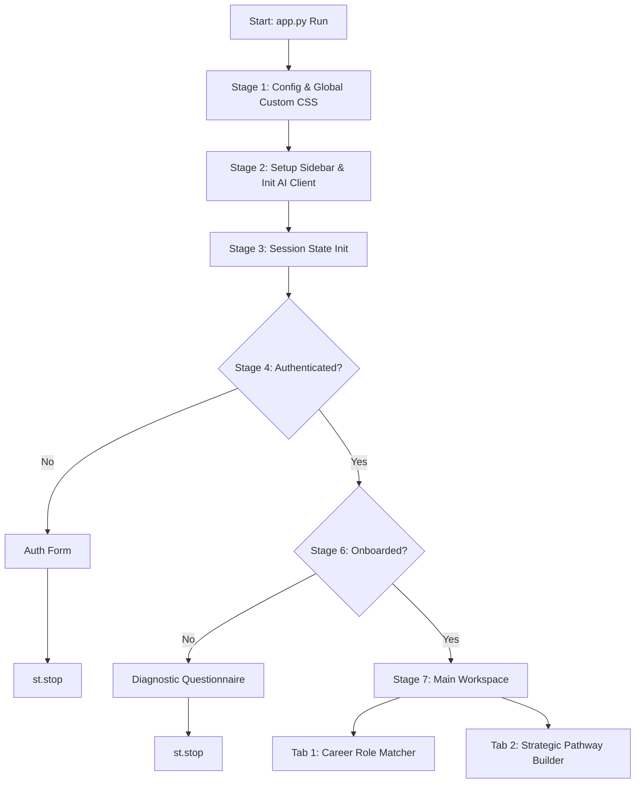

[version_control_documentation.md](https://github.com/user-attachments/files/28439098/version_control_documentation.md)
# CareerNexus AI | Codebase & Version Control Documentation

CareerNexus AI is an interactive, AI-driven corporate career strategist and pathfinding web application. It is designed to assist students and professionals in mapping their academic background, skills, and interests to ideal career roles, and constructing actionable career roadmaps to bridge skill gaps.

This documentation serves as the official reference report for version control, detailing the software architecture, technical stack, user flows, and state management.

---

## 🛠️ Technology Stack & Dependencies

The application is built on top of a streamlined, modern Python web stack designed for rapid development and clean component rendering:

*   **Frontend & Application Framework**: [Streamlit](https://streamlit.io/) (v1.58.0+)
    *   Used for reactive, single-page web rendering, component rendering, form handling, and tabbed workspaces.
*   **LLM Client Library**: [Google GenAI SDK](https://github.com/googleapis/google-genai) (v2.7.0+)
    *   Used to interface with the Gemini models (`gemini-2.5-flash`) for real-time career alignment, classification, and structured JSON parsing.
*   **Core Logic & Utilities**:
    *   `json` for parsing structured JSON output from Gemini models.
    *   `os` for retrieving environment-level API configuration keys.

### Dependency Specification (`requirements.txt`)
```text
streamlit
google-genai
```

---

## 🏗️ Architecture & Component Design

The application operates as a linear multi-stage user flow driven by Streamlit's session state. The script execution is structured into **seven sequential stages**:



### 1. Global Setup & Theming (Stage 1)
Sets up the browser title, layout constraints, and injects custom vanilla CSS.
*   **Fonts**: Inter (Sans-Serif)
*   **Aesthetic Style**: Premium modern card system, sleek status/badge indicators, and color-coded information callouts.

### 2. Client Initialization & API Authentication (Stage 2)
Authenticates connections to the Gemini API. Supports two authentication flows:
1.  **Environment Configuration**: Directly binds to the `GEMINI_API_KEY` system environment variable.
2.  **Runtime Sidebar Configuration**: For containerized or user-facing deployments without access to shell environment configurations, users can input their API Key directly in a password-masked field located in the sidebar. This key is stored in Streamlit's `st.session_state` and persists across workspace reruns.

### 3. Session State Schema (Stage 3)
Tracks the user's active session and profiling details across page loads:
*   `st.session_state.authenticated` *(bool)*: Controls entry into the workspace.
*   `st.session_state.user_profile` *(dict | None)*: Stores the student onboarding diagnostic data (degree, skills, hobbies, and psychometric questionnaire answers).
*   `st.session_state.current_user` *(str | None)*: Identifier for the active session.
*   `st.session_state.gemini_api_key` *(str)*: Fallback Gemini API authentication token.

### 4. Simplified Authentication Form (Stage 4)
Handles initial gatekeeping logic. Restricts access to authenticated sessions (default local credential: `student_demo`/`password123` for development).

### 5. Onboarding Diagnostics (Stage 6)
Collects structured diagnostic vectors from the user via standard input components:
*   **Degree / Academic Stream** (`st.selectbox`)
*   **Skills List** (`st.multiselect`)
*   **Out-of-class Hobbies** (`st.text_input`)
*   **Psychometric Interest Mapping** (`st.selectbox` for task rewarding and group dynamics placement)

### 6. AI Execution Engines (Stage 5 & Stage 7)
Coordinates prompt engineering schemas and model calls. All prompts require **structured JSON responses** enforced by `response_mime_type="application/json"` parameters in the client.

#### A. Skill-to-Role Matcher
*   **Prompt Architecture**: Instructs the model to act as a corporate career strategist and psychometric engine. Processes the student's onboarding diagnostics, matching them to exactly two target career paths.
*   **JSON Schema Output**:
    ```json
    {
        "matches": [
            {
                "title": "Exact Job Title",
                "domain": "Industry Domain",
                "match_reason": "Explanation of skill/hobby fit",
                "min_skills_met": ["Skill A", "Skill B"],
                "advanced_skills_needed": ["Future Skill 1", "Future Skill 2"]
            }
        ]
    }
    ```

#### B. Pathway Builder
*   **Prompt Architecture**: Models a customized trajectory toward a user-entered dream career, creating a personalized 3-phase roadmap matching their current academic status.
*   **JSON Schema Output**:
    ```json
    {
        "roadmap_steps": [
            {"title": "Phase 1: Title", "desc": "Phase details and gaps targeted"},
            {"title": "Phase 2: Title", "desc": "Phase details"},
            {"title": "Phase 3: Title", "desc": "Phase details"}
        ],
        "learning_modules": ["Course/Cert 1", "Course/Cert 2"],
        "upcoming_gateways": ["Entrance Exam/Internship 1", "Gateway 2"]
    }
    ```

---

## 📈 Version Control Changelog (Recent Updates)

The codebase has undergone significant structural hardening and user experience refinements:

| Feature/Fix | Description | Files Modified |
| :--- | :--- | :--- |
| **Dependency Refactoring** | Cleaned up invalid dependencies (`plain text` typo) from the installation specification. | [requirements.txt](file:///c:/Users/donjo/OneDrive/Desktop/app1/requirements.txt) |
| **Workspace Setup Panel** | Added a persistent `👋 Workspace Setup` config widget in the sidebar early in the execution stack. | [app.py](file:///c:/Users/donjo/OneDrive/Desktop/app1/app.py) |
| **Dynamic API Initialization** | Modified the client setup so it binds securely to either the environment key or the sidebar-configured key at runtime. | [app.py](file:///c:/Users/donjo/OneDrive/Desktop/app1/app.py) |
| **Graceful API Warnings** | Added error/warning dialogs across the onboarding screen and matching engine checks to instruct users on missing key configuration. | [app.py](file:///c:/Users/donjo/OneDrive/Desktop/app1/app.py) |
| **Bare Execution Support** | Ensured the script handles import tests and direct command executions safely without crashing on profile extraction. | [app.py](file:///c:/Users/donjo/OneDrive/Desktop/app1/app.py) |
